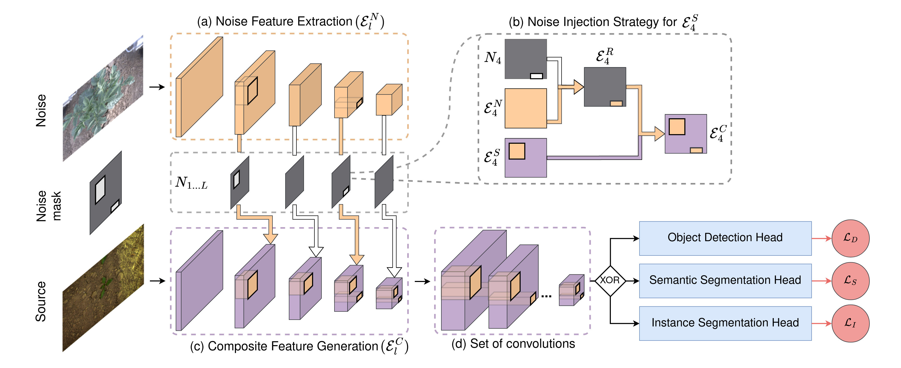

# INoD: Injected Noise Discriminator for Self-Supervised Representation Learning in Agricultural Fields

This repository contains the PyTorch implementation of the INoD model proposed in our RA-L 2023 paper [INoD: Injected Noise Discriminator for Self-Supervised Representation Learning in Agricultural Fields](https://ieeexplore.ieee.org/document/10202201).


## Methodology

The goal of injected feature discrimination is to make the network learn unequivocal representations of objects from one dataset while observing them alongside objects from a disjoint dataset. Accordingly, the pretraining is based on the premise of injecting features from a disjoint noise dataset into different feature levels of the original source dataset during its convolutional encoding. The network is then trained to determine the dataset affiliation of the resultant feature map which enables learning rich discriminative feature representations for different objects in the image.



## Model Zoo
Pre-trained models on [SugarBeets 2016](http://inod.cs.uni-freiburg.de/dataset/mask-sb16cp22.pkl) and our [Fraunhofer Potato](http://inod.cs.uni-freiburg.de/dataset/detec-cp22sb16.pkl) dataset  are available for download.

## System Requirement and Installation
- Linux (Tested on Ubuntu 20.04)
- Python3 (Tested using Python 3.8)
- Install all other python dependencies using [install.sh](./install.sh).

## Code execution
### Pretraining 
The configuration parameters of the model such as the learning rate, batch size, and dataloader options are stored in the ```inod/config``` folder. If you intend to modify the model parameters, please do so here.

#### Data Format

Pre-training datasets should be in the following format:
``` 
    - train.txt (path to all training images)
    - val.txt (path to all validation images)
    - std (dataset pixel std in .npy format)
    - mean (dataset pixel mean in .npy format)
    - train (all images)
        - folder1 
            - image1
                ...
```
Training with our [Fraunhofer Potato](http://inod.cs.uni-freiburg.de/?#dataset) dataset:

```
# multi-GPU (faster rcnn), set MASTER_ADDR and MASTER_PORT in pretrain.py
python pretrain.py [path to FP] [path to dataset2] FP --distributed --no_gpu 2 --config_file inod/configs/pretrain_fp_fasterrcnn.yaml 
# single GPU (faster rcnn)
python pretrain.py [path to FP] [path to dataset2] FP --gpu 0 --config_file inod/configs/pretrain_fp_fasterrcnn.yaml 
```

Training with [Sugar Beets 2016](https://www.ipb.uni-bonn.de/data/sugarbeets2016/) dataset:

```
# multi-GPU (faster rcnn), set MASTER_ADDR and MASTER_PORT in pretrain.py
python pretrain.py [path to SB16] [path to dataset2] SB16 --distributed --no_gpu 2
# single GPU (faster rcnn)
python pretrain.py [path to SB16] [path to dataset2] SB16 --gpu 0 

# multi-GPU (mask rcnn), set MASTER_ADDR and MASTER_PORT in pretrain.py
python pretrain.py [path to SB16] [path to dataset2] SB16 --distributed --no_gpu 2 --config_file inod/configs/pretrain_sb16_maskrcnn.yaml
# single GPU (mask rcnn)
python pretrain.py [path to SB16] [path to dataset2] SB16 --gpu 0 --config_file inod/configs/pretrain_sb16_maskrcnn.yaml 
```

### Fine-tuning
The configuration parameters of the model such as the learning rate, batch size, and dataloader options are stored in the ```finetuning/config``` folder. If you intend to modify the model parameters, please do so here.

#### Data Format

Fine-tuning datasets should be in the following format:
``` 
    - ImageSets (specifying path to train val and test images)
        - train.txt
        - val.txt
        - test.txt
    - std (std of dataset in .npy format)
    - mean (mean of dataset in .npy format)
    - train (all images)
        - folder1 
            - image1
                ...
```
Training with our [Fraunhofer Potato](http://inod.cs.uni-freiburg.de/?#dataset) dataset:

```
# single GPU (faster rcnn)
python finetune.py --weights detec-fpsb16.pkl --path [path to fp] --norm_path [path to fp] --config finetuning/configs/finetune_fp_fasterrcnn.yaml --challenge FP
```

Training with [Sugar Beets 2016](https://www.ipb.uni-bonn.de/data/sugarbeets2016/) dataset:

```
# single GPU (mask rcnn)
python finetune.py --weights mask-sb16fp.pkl --path [path to sb16] --norm_path [path to sb16] --config finetuning/configs/finetune_sb16_maskrcnn.yaml --challenge SB16
```

For multi-GPU training, set MASTER_ADDR and MASTER_PORT in finetune.py and enable multi-gpu flags ```--distributed --no_gpu 2``` for training.


## License
This code is released under the [GPLv3](https://www.gnu.org/licenses/gpl-3.0.en.html) for academic usage. For commercial usage, please contact [Julia Hindel](https://rl.uni-freiburg.de/people/hindel). If you report results based on the dataset or code, please consider citing the paper. 

```@article{hindel2023inod,
@article{hindel2023inod,
title={INoD: Injected Noise Discriminator for Self-Supervised Representation Learning in Agricultural Fields},
author={Julia Hindel and Nikhil Gosala and Kevin Bregler and Abhinav Valada},
journal={IEEE Robotics and Automation Letters (RA-L)},
year={2023},
}
```


## Acknowledgement
This work was partly funded by the German Research Foundation (DFG) Emmy Noether Program grant number 468878300.
